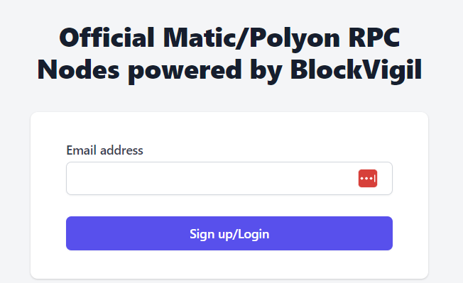
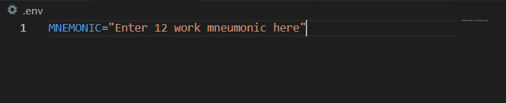

Setup
============

Matic RPC Account Setup
-----------------------

Open the website [Matic RTC](https://rpc.maticvigil.com/) and enter your email in the sign-up / login box shown below. Then add an application and get the Mumbai Testnet RPC URL, which should be https://rpc-mumbai.maticvigil.com/v1/{appId}

Adding URL to truffle-config.js
-------------------------------
Replace the URL in the provider with the one from the previous step.

~~~javascript
    matic: {
      provider: () => new HDWalletProvider(process.env.MNEMONIC, `https://rpc-mumbai.maticvigil.com/v1/{appId}`),
      network_id: 80001,
      confirmations: 2,
      timeoutBlocks: 200,
      skipDryRun: true
    },
~~~

Adding mnemonic
-----------------
Create a new file in the root directory named ".env" and add the line shown below, replacing the text with your wallet's 12 word mnemonic:

Adding Project Id and Secret
----------------------------
Enter the projectId and projectSecret into the lines below located in ./src/components/App.js:

~~~Javascript
const projectId = "<insert from Infura>";
const projectSecret = "<insert from Infura>";
~~~